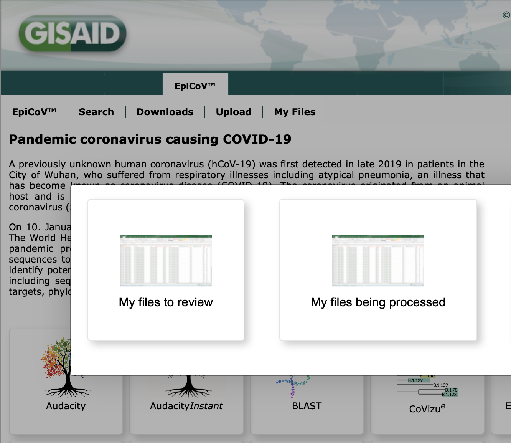

# GISAID CLI3
## Version 3 Command Line Interface (CLI) for batch uploading

## Description

`cli3` is version 3 of the Command Line Interface (CLI) for batch submissions of meta- and sequence-data to GISAID. Presently, the software allows upload to the EpiCoV database.

Queries, bug reports, feature requests, etc., should be emailed to `clisupport[at]gisaid.org`.

Use of this package requires some knowledge of the command line. To gain some basic skills using the `*nix` command line, please see e.g., [here](https://www.codecademy.com/learn/learn-the-command-line)

## Installation

This program requires `python3`. Installation also requires `pip3`, which comes as part of `python3`. Download [python 3.10](https://www.python.org/downloads/) and install it. For stability, this program should be installed into a virtual environment of your choosing. Here we will describe the process for installing the into an environment using `venv` or `conda`. `venv` comes prepackaged with `python3`. `conda` needs to be installed from [https://docs.conda.io/en/latest/miniconda.html](https://docs.conda.io/en/latest/miniconda.html). 

If you are reading this readme, then you have already downloaded and decompressed the cli3 compressed archive. 

### install into a virtual environment using `pip` and `venv`

Using `venv` and `pip`, install the `cli3` by doing:

```
cd gisaid_cli3
python3 -m venv cli3venv
source cli3venv/bin/activate
pip3 install .
cli3 -h
```

To deactivate the environment, do:

```
deactivate
```

To re-activate the environment and run the software do:

```
source cli3venv/bin/activate
cli3 -h
```

#### uninstall

```
deactivate
rm -rf cli3venv/bin/activate
```

### `conda`
#### install

To install `cli3` into a `conda` environment, do:

```
cd gisaid_cli3
conda init --all
export PATH=${PATH}:/bin:/usr/bin:/sbin:/usr/sbin
conda update -y conda
conda env create -f environment.yml
conda activate cli3_env
cli3 -h
```

#### uninstall

```
conda remove --name cli3_env --all
```

## Usage
### Get help, top level

The software tool is run with the `cli3` command. To get help, trail any command with `-h`. For example, to get top-level help, do:

```
usage: cli3 [-h]  ...

Version 3 Command Line Interface (CLI) for uploading sequence and metadata to GISAID.

optional arguments:
  -h, --help    show this help message and exit

Sub-commands help:

    authenticate
                Write the authentication token.
    upload      Upload sequences and metadata.
    version     Show version and exit.
    template    Print to stdout the template.csv instructions or the 'template.csv' file per se.
```

There are four `cli3` sub-commands:

- `cli3 authenticate` (refer to section 1, below)
- `cli3 upload` (refer to section 2)
- `cli3 version` (refer to section 3)
- `cli3 template` (refer to section 4)


### 1. Authenticate

Before uploading, you will need to authenticate your connection. This is done by creating an authentication "token" with `cli3 authenticate`. Authentication tokens are valid for 100 days. The generated token is specific to a client-ID, username and password combination. **To obtain a client-ID, please email clisupport[at]gisaid.org to request.**

To reset a token, delete the token file and re-run `cli3 authenticate`, or overwrite the token using `cli3 authenticate --force`. When the `--username`, `--password` and/or `--client_id` fields are left blank, the program will ask for them interactively (thus avoiding storing confidential text in the terminal history). By default, the authentication token file will be `./gisaid.authtoken`; however, you may specify a different path and filename using the `--token` option.

When using the `--proxy` internet proxy option during authentication, store the input string in an environment variable and input the environment variable instead of entering usernames and passwords in plain text.

To get help on the authentication sub-command, do `cli3 authenticate -h`:

```
Write the authentication token.

optional arguments:
  -h, --help            show this help message and exit
  --token TOKEN         Authentication token. (default: ./gisaid.authtoken)
  --username USERNAME   Your GISAID username. Leave blank on shared computers. (default: None)
  --password PASSWORD   Your GISAID password. Leave blank on shared computers. (default: None)
  --client_id CLIENT_ID
                        Submitter's client-ID. Leave blank on shared computers. Email clisupport@gisaid.org to request client-ID. (default: None)
  --force               Switch on force overwrite of token given at --token (default: False)
  --proxy PROXY         Proxy-configuration for HTTPS-Request in the form: http(s)://username:password@proxy:port. (default: None)
  --log LOG             All output logged here. (default: ./logfile.log)
```

### 2. Upload

With the authentication token created, the upload may proceed. The upload will require a metadata file in [csv format](https://en.wikipedia.org/wiki/Comma-separated_values) and a sequences file in [fasta format](https://en.wikipedia.org/wiki/FASTA_format). For large uploads, use a persistent terminal screen via `tmux` or `screen`. If a submission is interrupted part-way through, re-run the `cli3 upload` command and the submission should continue from at or near the interruption.

To get help on the upload sub-command, do `cli3 upload -h`:

```
usage: cli3 upload [-h] [--token TOKEN] --metadata METADATA --fasta FASTA [--frameshift {catch_all,catch_novel,catch_none}] [--failed FAILED] [--proxy PROXY] [--log LOG]

Perform upload of sequences and metadata to GISAID's curation zone.

optional arguments:
  -h, --help            show this help message and exit
  --token TOKEN         Authentication token. (default: ./gisaid.authtoken)
  --metadata METADATA   The csv-formatted metadata file. (default: None)
  --fasta FASTA         The fasta-formatted nucleotide sequences file. (default: None)
  --frameshift {catch_all,catch_novel,catch_none}
                        'catch_none': catch none of the frameshifts and release immediately; 'catch_all': catch all frameshifts and require email confirmation; 'catch_novel': catch novel frameshifts and require email confirmation.
                        (default: catch_all)
  --failed FAILED       Name of output file to log failed records. (default: ./failed.out)
  --proxy PROXY         Proxy-configuration for HTTPS-Request in the form: http(s)://username:password@proxy:port. (default: None)
  --log LOG             All output logged here. (default: ./logfile.log)
```

During upload, a message similar to the following will be printed by default to `stdout` and `./logfile.log`:

```
missing_seq:    hCoV-19/x/x390/2022
epi_isl_id:     hCoV-19/Anzark/12/2022; EPI_ISL_4348356
epi_isl_id:     hCoV-19/Anzark/13/2022; EPI_ISL_4348357
epi_isl_id:     hCoV-19/Anzark/17/2022; EPI_ISL_4348358
epi_isl_id:     hCoV-19/Anzark/16/2022; EPI_ISL_4348359
validation_error:       hCoV-19/Anzark/17/2022; validation_error; {"covv_virus_name": "already exists"}
validation_error:       hCoV-19/x/x390/2022; validation_error; {"covv_sequence": "field_mandatory_error"}
epi_isl_id:     hCoV-19/Anzark/Melbourne473/2022; EPI_ISL_4348360
epi_isl_id:     hCoV-19/Anzark/Melbourne476/2022; EPI_ISL_4348361
epi_isl_id:     hCoV-19/Anzark/Melbourne477/2022; EPI_ISL_4348362
epi_isl_id:     hCoV-19/Anzark/Melbourne475/2022; EPI_ISL_4348363
upload_count:   submissions uploaded: 8
failed_count:   submissions failed: 2

Total runtime (HRS:MIN:SECS): 0:00:02.668939
```

For each record, the logfile will capture the assigned EPI_ISL accession alongside the corresponding `covv_virus_name`. Metadata for failed uploads are appended to `failed.out`.

Duplicate sequences (detected by scanning for duplicates in the `covv_virus_name` field) will result in `validation error: "covv_virus_name": "already exists"`.

Additional runs will append logs and failures to existing logs and failed by default.

You can manage submissions in [gisaid.org](https://www.gisaid.org) by going to "EpiCoV -> My Files" as shown here:




#### 2.1 Frameshifts

The option `--frameshift` is used to set notification preferences for detected "open reading frame" shifts, or "frameshifts". The choices for the `--frameshift` option corresponds with options in the drop down menu in the graphic web front-end batch upload submission page. The choices are:

```
catch_all = "Notify me about ALL DETECTED FRAMESHIFTS in this submission for reconfirmation of affected sequences".
catch_novel = "Notify me only about NOT PREVIOUSLY REPORTED FRAMESHIFTS in this submission for reconfirmation of affected sequences"
catch_none = "I confirm ANY FRAMESHIFTS in this submission and request their release without confirmation by a curator"
```

For choice `catch_none`, curators will not notify submitters of frameshifts in the sequence data: records will be released immediately to the live database if all other QC metrics meet release criteria.

Choices `catch_all` (default) and `catch_novel` will result in emails being sent to the submitter, requiring confirmation of frameshifts before release of records to the live database.

### 3. Version

To get the software version number, do:

```
cli3 version
```

This user manual is concurrent with version:

```
cli3 version:   3.0.4
```

### 4. Template

For assistance with formatting the sequence headers and metadata file, run  `cli3 template`.  To print a copy of the `template.csv` file to stdout run `cli3 template --template`

To get help on this subcommand, run `cli3 template -h`.

```
usage: cli3 template [-h] [--template]

Print to stdout the formatting instructions for the metadata file, or print the 'template.csv' file per se.

optional arguments:
  -h, --help            show this help message and exit
  --template            Print submission 'template.csv' file per se. (default: False)
```

## Support

Please direct your CLI inquiry to `clisupport[at]gisaid.org`.

## FAQ

_How do I set preferences for frameshifts notifications for my upload?_ Use the `--frameshifts` option as outlined in section **2.1 Frameshifts**.

_What does the error "submitter\_invalid" mean? Note, I have created a `*.authtoken` file successfully and everything seemed ready to go._ The `submitter` column in the `metadata.csv` file likely contains an email address that is not authenticated for use by the user who created the `*.authtoken` file. To fix, either: 1) email `clisupport[at]gisaid.org` to request adding the email address(es) to the list of authorised email addresses for the submitter (e.g., if you are uploading on behalf of other users, aka "proxy" submitter, not to be confused with "internet proxy" under the `--proxy` option); 2) change the email address in the row of the metadata file to be equal to the email address of the user who created the `*.authtoken` file.

_On attempting to upload data, what does the error `validation_error; {"covv_location": "format_error"}` mean?_ This is caused by incorrect `covv_location` formatting. The following are acceptable: `continent / country / region` and `continent / country / region / sub-region`, but; `country / region / sub-region`, `country / region` and `region / sub-region` are not. Hence, `Europe/Germany/Bavaria/Munich` and `Europe/Germany/Bavaria` are acceptable, but `Mexico / Jalisco / Puerto Vallarta` needs to be corrected to `North America / Mexico / Jalisco / Puerto Vallarta`. Spaces and hyphens in the location are allowed.

_What does `validation_error; {"covv_sequence": "field_mandatory_error"}` mean?_ This is caused by any of two possibilities.  The first is actual missing sequence data, so the fasta file contains the sequence header (denoted by the `>` character) but no sequence data after the header.  The second is a sequence indicated by `covv_virus_name` in the `*.csv` file but is not in the `*.fa`. Consult the stdout, the log and failed files to further diagnose the problem. If all else fails, email `clisupport[at]gisaid.org` for further assistance.

_I have submitted sequences for which the metadata or sequence data need correcting. How do I correct this_?  If the data were recently submitted, make the changes in `My Files` (see section 2 above). Otherwise, email `service[at]gisaid.org` with the `EPI_ISL` accessions and the fields to update as a table (xls, csv or tsv) file. Add additional instructions in the email body.

_I have re-infection samples from a patient for which I have previously submitted sequences. How do I link my new record to previous records?_ In the `covv_add_host_info` column, add a note to reference the `EPI_ISL` accession of the previous record.

_How do I add additional information to the location field?_ Use the `covv_add_location` field to add the extra data (e.g., LatLong, suburb, postcode etc.).

_What does `date inplausible` mean in the error messages?_ This error can be caused by having a date value younger than the present day (Central European Time), or having the year value in the `covv_virus_name` field not equal to the year value in `covv_collection_date`. If the latter, change the year in the metadata `covv_virus_name` to match the year in `covv_collection_date` AND change the sequence header in the fasta file to match the changed `covv_virus_name`.

_How do I know when my `gisaid.authtoken` will expire?_ Look in the `gisaid.authtoken` file under the key `expiry` (either manually using e.g., `less -S gisaid.authtoken` or `cat gisaid.authtoken` or opening the file in a plain text editor, or programatically using e.g., `jq`).

