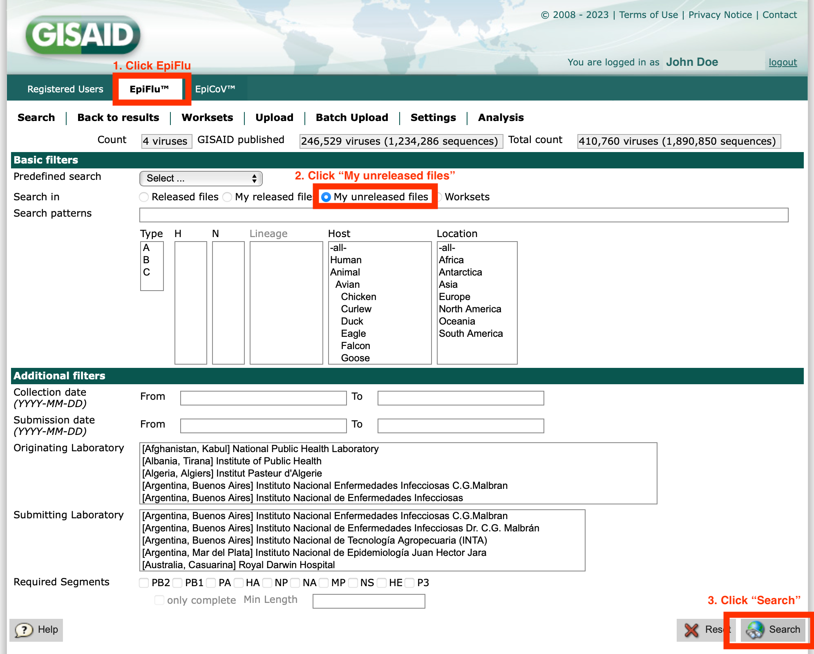
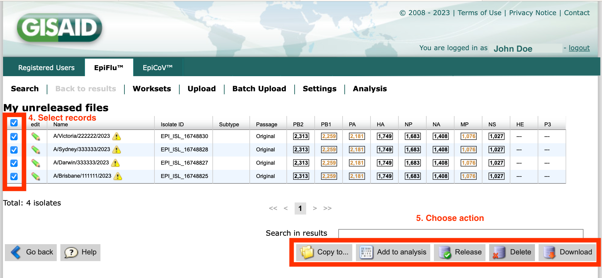

# GISAID EpiFlu™ Command Line Interface
## Command Line Interface (CLI) for batch uploading consensus sequences and metadata to GISAID's EpiFlu™

## 1. Description {#1}

This document describes the installation and usage of the `epiflu_cli` Software used to make batch submissions of meta-data and consensus-sequence-data to GISAID from the command line to EpiFlu™, and is subject to the terms and conditions of the accompanying End User License Agreement (EULA).

Queries, bug reports, feature requests, etc., should be emailed to `clisupport [at] gisaid.org`.

Use of this package requires familiarity with the `*nix` command line terminal. For a basic overview, please refer to [https://developer.mozilla.org/en-US/docs/Learn/Tools_and_testing/Understanding_client-side_tools/Command_line](https://developer.mozilla.org/en-US/docs/Learn/Tools_and_testing/Understanding_client-side_tools/Command_line).

## 2. Installation {#2}

`epiflu_cli` has been tested with `python >=3.8.16`. Use of older versions of `python` may result in unexpected behaviour, in which case please upgrade `python`.

### 2.1 Using `venv`
#### 2.1.1 Install

For maximum stability, `epiflu_cli` should be installed into a virtual environment of your choosing. Here we describe the process for installing into a virtual environment using `python3`'s inbuilt `venv`.

After downloading the `gisaid_epiflu_cli.zip` archive from GISAID, install `epiflu_cli` into a virtual environment by doing:

```
unzip gisaid_epiflu_cli.zip -d epiflu_cli && \
cd epiflu_cli && \
python3 -m venv fluvenv && \
source fluvenv/bin/activate && \
pip3 install --upgrade pip && \
pip3 install -r requirements.txt
```

To deactivate the `fluvenv` environment, do:

```
deactivate
```

To run `epiflu_cli`, the virtual environment will need to be activated. To re-activate the above virtual environment, do:

```
source fluvenv/bin/activate
```

#### 2.1.2 Uninstall the `fluvenv` environment (optional)

To remove `epiflu_cli` from the system, simply delete the `fluvenv` folder. In the above example, where the user is already in the `epiflu_cli` folder and the `fluvenv` environment is still active, run:

```
deactivate
rm -rf fluvenv
```

For installation in (and uninstallation from) other authorized locations, substitute the folder paths to `epiflu_cli` and `fluvenv` appropriately. Full or relative paths are valid.
 

## 3. Usage {#3}

Prior to first usage of this Software, the user will need to make one manual submission using the upload tab in EpiFlu™ via the web-browser. After making a manual submission, permissions will be automatically granted for the user to make uploads via the epiflu_cli interface.

### Get help, top level

The `fluvenv` virtual environment will need to be activated to run `epiflu_cli`. After activating, get help by trailing any command with `-h`. For example, to get top-level help, do `epiflu_cli -h` – if the Software is installed correctly, the `stdout` (i.e., "standard out") will read as follows (if not, contact `clisupport [at] gisaid.org` for assistance):

```
epiflu_cli -h
usage: epiflu_cli [-h]  ...

Command Line Interface (CLI) for uploading Influenza sequence and metadata to GISAID's EpiFlu.

options:
  -h, --help    show this help message and exit

Sub-commands help:
  
    authenticate
                Write the authentication token.
    upload      Upload sequences and metadata.
    labs        Print laboratories with IDs available for uploading.
    version     Show version and exit.
    template    Print template and formatting instructions
```

The above output shows five sub-commands:

- `epiflu_cli authenticate` (refer to section [3.1](#3.1))
- `epiflu_cli upload` (refer to section [3.2](#3.2))
- `epiflu_cli labs` (refer to section [3.3](#3.3))
- `epiflu_cli version` (refer to section [3.4](#3.4))
- `epiflu_cli template` (refer to section [3.5](#3.5))

### 3.1 Authenticate {#3.1}

Before uploading, authenticate the connection by creating an authentication token with `epiflu_cli authenticate`. Authentication tokens are valid for 100 days. The generated token is specific to EpiFlu™ and a combination of: client-ID, username and password. **To obtain a client-ID, please email `clisupport [at] gisaid.org` to request.**

To reset a token, delete the existing token file (specified at `--token`) and re-run `epiflu_cli authenticate`, or overwrite using `epiflu_cli authenticate --force`. When the `--username`, `--password` and/or `--client_id` fields are left blank, the program will ask for them interactively, thus avoiding storing confidential text in the terminal history.

By default, the authentication token file will be `./gisaid.authtoken`; however, you may specify a different path and filename using the `--token` option. The custom token path is passed into the upload step using the `--token` option.

An example command for creating a token for EpiFlu™ would be:

```
epiflu_cli authenticate --token flu.authtoken
```

When using the `--proxy` internet proxy option during authentication, store the input string in an environment variable and input the environment variable to simplify writing of complex or confidential strings.

To get help on the authentication sub-command, do `epiflu_cli authenticate -h` (N.B., the default options are listed here too):

```
usage: epiflu_cli authenticate [-h] [--token TOKEN] [--username USERNAME] [--password PASSWORD] [--client_id CLIENT_ID] [--force] [--log LOG] [--proxy PROXY] [--debug]

Write the authentication token.

options:
  -h, --help            show this help message and exit
  --token TOKEN         Authentication token. (default: flu.authtoken)
  --username USERNAME   Your GISAID username. (default: None)
  --password PASSWORD   Your GISAID password. (default: None)
  --client_id CLIENT_ID
                        Submitter's client-ID. Email clisupport[at]gisaid.org to request client-ID. (default: None)
  --force               Switch on force overwrite of token given at --token (default: False)
  --log LOG             All output logged here. (default: ./logfileFlu.log)
  --proxy PROXY         Proxy-configuration for HTTPS-Request in the form: 'proxyusername:proxypassword@proxy:port' or 'proxy:port' if no proxy authentication is required. (default: None)
  --debug               Switch on traceback for debugging purposes. (default: False)
```

### 3.2. Upload {#3.2}

After creating an authentication token, the upload may proceed. The upload will require a metadata file in [csv format](https://en.wikipedia.org/wiki/Comma-separated_values), a sequences file in [fasta format](https://en.wikipedia.org/wiki/FASTA_format) and an authentication token specified by the `--token` option. By default, the token file is `flu.authtoken` as outlined in the `stdout` produced by running the `epiflu_cli upload -h` command. For large uploads, use a persistent terminal screen via `tmux` or `screen`. If a submission is interrupted part-way through, re-run the `epiflu_cli upload` command and the submission should continue from at or near the interruption. Any sequences and metadata already submitted will not be re-assigned EPI_ISL accessions. For interrupted uploads, check the `logfileFlu.log` to determine the point at which the upload was interrupted. 

To get help on the upload sub-command, do `epiflu_cli upload -h`:

```
usage: epiflu_cli upload [-h] [--token TOKEN] [--log LOG] --metadata METADATA --fasta FASTA [--proxy PROXY] [--debug] [--dateformat {YYYYMMDD,YYYYDDMM,DDMMYYYY,MMDDYYYY}]

Perform upload of sequences and metadata to GISAID's EpiFlu.

options:
  -h, --help            show this help message and exit
  --token TOKEN         Authentication token. (default: flu.authtoken)
  --log LOG             All output logged here. (default: ./logfileFlu.log)
  --metadata METADATA   The csv-formatted metadata file. (default: None)
  --fasta FASTA         The fasta-formatted nucleotide sequences file. (default: None)
  --proxy PROXY         Proxy-configuration for HTTPS-Request in the form: 'proxyusername:proxypassword@proxy:port' or 'proxy:port' if no proxy authentication is required. (default: None)
  --debug               Switch on traceback for debugging purposes. (default: False)
  --dateformat {YYYYMMDD,YYYYDDMM,DDMMYYYY,MMDDYYYY}
                        Specify the date format, with 'Y' for 'year', 'M' for 'month', 'D' for 'day'. Dates will parse correctly with the following delimiters: '/', '.', '–' or '-'. (default: YYYYMMDD)
```

In the example below, data for four samples were uploaded to EpiFlu™. The example data comprised sequences of eight segments for each sample. The example segments were HA, NA, PB1, PB2, PA, MP, NS, and NP. For these data, a successful upload resulted in the following EPI_ISL isolate numbers and EPI segment numbers being printed to `stdout` and `./logfileFlu.log`:

```
epi_isl_id: A/Victoria/222222/2023; EPI_ISL_16748830
epi_isl_id: A/Darwin/333333/2023; EPI_ISL_16748827
epi_isl_id: A/Sydney/333333/2023; EPI_ISL_16748828
epi_isl_id: A/Brisbane/111111/2023; EPI_ISL_16748825
epi_id: A/Victoria/222222/2023_HA; EPI2334834
epi_id: A/Darwin/333333/2023_NA; EPI2334806
epi_id: A/Darwin/333333/2023_PA; EPI2334808
epi_id: A/Brisbane/111111/2023_NP; EPI2334797
epi_id: A/Brisbane/111111/2023_NS; EPI2334800
epi_id: A/Victoria/222222/2023_PA; EPI2334833
epi_id: A/Victoria/222222/2023_NA; EPI2334832
epi_id: A/Victoria/222222/2023_NS; EPI2334840
epi_id: A/Darwin/333333/2023_MP; EPI2334816
epi_id: A/Sydney/333333/2023_PA; EPI2334820
epi_id: A/Sydney/333333/2023_MP; EPI2334831
epi_id: A/Sydney/333333/2023_PB1; EPI2334826
epi_id: A/Victoria/222222/2023_NP; EPI2334836
epi_id: A/Victoria/222222/2023_PB1; EPI2334838
epi_id: A/Sydney/333333/2023_PB2; EPI2334829
epi_id: A/Victoria/222222/2023_PB2; EPI2334843
epi_id: A/Brisbane/111111/2023_PB1; EPI2334798
epi_id: A/Brisbane/111111/2023_PB2; EPI2334802
epi_id: A/Darwin/333333/2023_PB2; EPI2334815
epi_id: A/Darwin/333333/2023_PB1; EPI2334813
epi_id: A/Brisbane/111111/2023_MP; EPI2334804
epi_id: A/Sydney/333333/2023_NA; EPI2334818
epi_id: A/Darwin/333333/2023_NS; EPI2334814
epi_id: A/Sydney/333333/2023_HA; EPI2334823
epi_id: A/Brisbane/111111/2023_HA; EPI2334796
epi_id: A/Darwin/333333/2023_NP; EPI2334811
epi_id: A/Brisbane/111111/2023_NA; EPI2334793
epi_id: A/Sydney/333333/2023_NP; EPI2334824
epi_id: A/Sydney/333333/2023_NS; EPI2334828
epi_id: A/Brisbane/111111/2023_PA; EPI2334795
epi_id: A/Victoria/222222/2023_MP; EPI2334844
epi_id: A/Darwin/333333/2023_HA; EPI2334810
msg: Bulk upload successfully finished

Total runtime (HRS:MIN:SECS): 0:00:26.171829
```

The logfile will automatically capture a copy of all `stdout` and any assigned EPI_ISL isolate and EPI segment numbers.

Additional runs will append to the existing log by default or to the file specified at `--log`.

You can manage submissions in [gisaid.org](https://www.gisaid.org) EpiFlu™ "Search" tab, as shown below at steps 1 to 5:






### 3.3 Labs {#3.3}

The `labs` sub-command helps submitters to determine the laboratory numbers to include in the metadata file (refer to [3.2](#3.2)). Users must have a valid authentication token to view the output of this command. 

```
epiflu_cli labs -h
usage: epiflu_cli labs [-h] [--token TOKEN] [--log LOG] [--proxy PROXY] [--debug]

Print laboratories with IDs available for uploading.

optional arguments:
  -h, --help     show this help message and exit
  --token TOKEN  Authentication token. (default: flu.authtoken)
  --log LOG      All output logged here. (default: ./logfileFlu.log)
  --proxy PROXY  Proxy-configuration for HTTPS-Request in the form: 'proxyusername:proxypassword@proxy:port' or 'proxy:port' if no proxy authentication is required. (default: None)
  --debug        Switch on traceback for debugging purposes. (default: False)
```

To filter the output, use `grep`. Limit the output with `less`. Search within the `less` output by hitting the '/' key and typing the search term. Get help on `grep` with `man grep`, and get help on `less` with `man less`, or typing `less` and then hitting the `h` key.


### 3.4 Version {#3.4}

To get the Software version number, do:

```
epiflu_cli version
```

This user manual is concurrent with version:

```
epiflu_cli version:   1.0.1
```

### 3.5 Template {#3.5}

For assistance with formatting the sequence headers and the metadata file, run  `epiflu_cli template`.  To print a copy of the `template.csv` file to `stdout` run `epiflu_cli template --template`. The screen output can be re-directed to file using:

`epiflu_cli template --template > template.csv`

To get help on the `template` subcommand, run `epiflu_cli template -h`.

```
epiflu_cli template -h
usage: epiflu_cli template [-h] [--template] [--debug]

Print to stdout the formatting instructions for the metadata file, or print the 'template.csv' file per se.

optional arguments:
  -h, --help  show this help message and exit
  --template  Print submission 'template.csv' file per se. (default: False)
  --debug     Switch on traceback for debugging purposes. (default: False)
```

## 4. Support {#4}

Please direct your CLI enquiries to `clisupport [at] gisaid.org`.

## 5. FAQ {#5}

_How do I know when my `flu.authtoken` will expire?_ Look in the `flu.authtoken` file under the `expiry` key (either manually using e.g., `less -S gisaid.authtoken`, `cat gisaid.authtoken`, open the file in a plain text editor, or search using the command line tool `jq` with the command `cat flu.authtoken| jq '.flu | .expiry'`).

