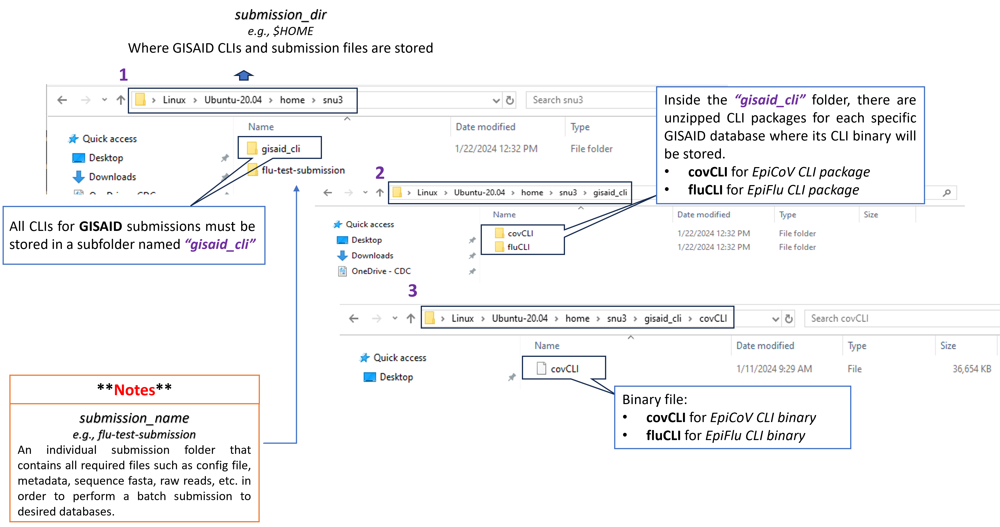

```{r, include=FALSE, echo=FALSE, message=FALSE, warning=FALSE}
# R libraries
library(yaml)  # for yaml file

# Read in the DESCRIPTION file
description <- yaml::read_yaml("DESCRIPTION")

# Define variables
program <- description$Package
version <- description$Version

# Define github repo
github_repo <- description$URL

# Define github pages URL
github_pages_url <- description$GITHUB_PAGES
```

<!--  -->
<!--  -->
<!--  -->

<p style="font-size: 16px;"><em>Public Database Submission Pipeline</em></p>

**Beta Version**: `r version`. This pipeline is currently in Beta testing, and issues could appear during submission. Please use it at your own risk. Feedback and suggestions are welcome! 

**General Disclaimer**: This repository was created for use by CDC programs to collaborate on public health related projects in support of the [CDC mission](https://www.cdc.gov/about/organization/mission.htm).  GitHub is not hosted by the CDC, but is a third party website used by CDC and its partners to share information and collaborate on software. CDC use of GitHub does not imply an endorsement of any one particular service, product, or enterprise.

# [Documentation](`r github_pages_url`/index.html)

## Overview

``r program`` is a Python program that is developed to automate the process of generating necessary submission files and batch uploading them to <ins>NCBI archives</ins> (such as **BioSample**, **SRA**, and **Genbank**) and <ins>GISAID databases</ins> (e.g. **EpiFlu** and **EpiCoV**). Presently, the pipeline is capable of uploading **Influenza A Virus** (FLU) and **SARS-COV-2** (COV) data. However, the dynamic nature of this pipeline can allow for additional uploads of other organisms in future updates or requests.

## Contacts

| Role       | Contact |
| ---------- | ------- |
| Creator    | [Dakota Howard](https://github.com/dthoward96), [Reina Chau](https://github.com/rchau88) |
| Maintainer | [Dakota Howard](https://github.com/dthoward96) |
| Back-Up    | [Reina Chau](https://github.com/rchau88), [Brian Lee](https://github.com/leebrian) |

## Prerequisites

- **NCBI Submissions**

``r program`` utilizes an UI-Less Data Submission Protocol to bulk upload submission files (e.g., *submission.xml*, *submission.zip*, etc.) to NCBI archives. The submission files are uploaded to the NCBI server via FTP on the command line. Before attempting to submit a submission using ``r program``, submitter will need to

1. Have a NCBI account. To sign up, visit [NCBI website](https://account.ncbi.nlm.nih.gov/).

2. Required for CDC users and highly recommended for others is creating a center account for your institution/lab [NCBI Center Account Instructions](https://submit.ncbi.nlm.nih.gov/sarscov2/sra/#step6). Center accounts allow you to perform submissions UI-less submissions as your institution/lab.
    
3. Required for CDC users and also recommended is creating a submission group in [NCBI Submission Portal](https://submit.ncbi.nlm.nih.gov). A group should include all individuals who need access to UI-less submissions through the web interface with your center account. Each member of the group must also have an individual NCBI account. [NCBI website](https://account.ncbi.nlm.nih.gov/).

4. Refer to this page for information regarding requirements for GenBank submissions via FTP only. This page applies only for COVID and Influenza [NCBI GenBank FTP Submissions](https://submit.ncbi.nlm.nih.gov/sarscov2/genbank/#step5) For further questions contact <a href="mailto:gb-admin@ncbi.nlm.nih.gov">gb-admin@ncbi.nlm.nih.gov</a> to discuss requirements for submissions.

5. Coordinate a NCBI namespace name (**spuid_namespace**) that will be used with Submitter Provided Unique Identifiers (**spuid**) in the submission. The liaison of **spuid_namespace** and **spuid** is used to report back assigned accessions as well as for cross-linking objects within submission. The values of **spuid_namespace** are up to the submitter to decide but they must be unique and well-coordinated prior to make a submission. For more information about these two fields, see [BioSample](`r github_pages_url`/articles/biosample_submission.html#metadata) / [SRA](`r github_pages_url`/articles/sra_submission.html#metadata) / [GENBANK](`r github_pages_url`/articles/genbank_submission.html#metadata) metadata requirements.

- **GISAID Submissions**

``r program`` makes use of GISAID's Command Line Interface tools to bulk uploading meta- and sequence-data to GISAID databases. Presently, the pipeline only allows upload to EpiFlu (**Influenza A Virus**) and EpiCoV (**SARS-COV-2**) databases. Before uploading, submitter needs to 

1. Have a GISAID account. To sign up, visit [GISAID Platform](https://gisaid.org/). 

2. Request a client-ID for EpiFlu or EpiCoV database in order to use its CLI tool. The CLI utilizes the client-ID along with the username and password to authenticate the database prior to make a submission. To obtain a client-ID, please email <a href="mailto:clisupport@gisaid.org" >clisupport@gisaid.org</a> to request. _**Important note**: If submitter would like to upload a "test" submission first to familiarize themselves with the submission process prior to make a real submission, one should additionally request a test client-id to perform such submissions._

3. Download the <a href="`r github_pages_url`/articles/images/fluCLI_download.png" target="_blank">EpiFlu</a> or <a href="`r github_pages_url`/articles/images/covCLI_download.png" target="_blank">EpiCoV</a> CLI from the **GISAID platform** and stored them in the destination of choice prior to perform a batch upload.

Here is a quick look of where to store the downloaded **GISAID CLI** package.




## Requirement Files

Before submitters can perform a batch submission using ``r program``, they must make sure the requirement files (such as *config.yaml*, *metadata.csv*, *sequence.fasta*, *raw reads*, etc.) are already prepared and stored in a submission directory of choice.

(a) To prep for FLU submissions, select one of the databases below to get started:

> <a href="`r github_pages_url`/articles/biosample_submission.html" target="_blank">BioSample</a> <br>
> <a href="`r github_pages_url`/articles/sra_submission.html" target="_blank">SRA</a> <br>
> <a href="`r github_pages_url`/articles/genbank_submission.html" target="_blank">Genbank</a> <br>
> <a href="`r github_pages_url`/articles/gisaid_flu_submission.html" target="_blank">GISAID</a> <br>
<!-- > <a href="`r github_pages_url`/articles/multiple_databases_flu_submission.html" target="_blank">Multiple databases</a> -->

(b) To prep for COV submissions, select one of the databases below to get started:

> <a href="`r github_pages_url`/articles/biosample_submission.html" target="_blank">BioSample</a> <br>
> <a href="`r github_pages_url`/articles/sra_submission.html" target="_blank">SRA</a> <br>
> <a href="`r github_pages_url`/articles/genbank_submission.html" target="_blank">Genbank</a> <br>
> <a href="`r github_pages_url`/articles/gisaid_cov_submission.html" target="_blank">GISAID</a> <br>
<!-- > <a href="`r github_pages_url`/articles/multiple_databases_cov_submission.html" target="_blank">Multiple databases</a> -->

## Quick Start

- [How to run seqsender locally](`r github_pages_url`/articles/local_installation.html)
- [How to run seqsender with Docker](`r github_pages_url`/articles/docker_installation.html)
- [How to run seqsender with Compose](`r github_pages_url`/articles/compose_installation.html)
- [How to run seqsender with Singularity](`r github_pages_url`/articles/singularity_installation.html)

## Code Attributions

Dakota Howard and Reina Chau for majority of the code base with input and testing from [colleagues](`r github_pages_url`/authors.html). 

## Public Domain Standard Notice

This repository constitutes a work of the United States Government and is not subject to domestic copyright protection under 17 USC § 105. This repository is in the public domain within the United States, and copyright and related rights in the work worldwide are waived through the [CC0 1.0 Universal public domain dedication](https://creativecommons.org/publicdomain/zero/1.0/). All contributions to this repository will be released under the CC0 dedication. By submitting a pull request you are agreeing to comply with this waiver of copyright interest.

## License Standard Notice

The repository utilizes code licensed under the terms of the Apache Software License and therefore is licensed under ASL v2 or later.

This source code in this repository is free: you can redistribute it and/or modify it under the terms of the Apache Software License version 2, or (at your option) any later version.

This source code in this repository is distributed in the hope that it will be useful, but WITHOUT ANY WARRANTY, without even the implied warranty of MERCHANTABILITY, or FITNESS FOR A PARTICULAR PURPOSE. See the Apache Software License for more details.

You should have received a copy of the Apache Software License along with this program. If not, see http://www.apache.org/licenses/LICENSE-2.0.html

The source code forked from other open source projects will inherit its license.

## Privacy Standard Notice

This repository contains only non-sensitive, publicly available data and information. All material and community participation is covered by the [Disclaimer](https://github.com/CDCgov/template/blob/master/DISCLAIMER.md) and [Code of Conduct](https://github.com/CDCgov/template/blob/master/code-of-conduct.md). For more information about CDC's privacy policy, please visit [http://www.cdc.gov/other/privacy.html](https://www.cdc.gov/other/privacy.html).

## Contributing Standard Notice

Anyone is encouraged to contribute to the repository by [forking](https://help.github.com/articles/fork-a-repo) and submitting a pull request. (If you are new to GitHub, you might start with a [basic tutorial](https://help.github.com/articles/set-up-git).) By contributing to this project, you grant a world-wide, royalty-free, perpetual, irrevocable, non-exclusive, transferable license to all users under the terms of the [Apache Software License v2](http://www.apache.org/licenses/LICENSE-2.0.html) or later.

All comments, messages, pull requests, and other submissions received through CDC including this GitHub page may be subject to applicable federal law, including but not limited to the Federal Records Act, and may be archived. Learn more at [http://www.cdc.gov/other/privacy.html](http://www.cdc.gov/other/privacy.html).

## Records Management Standard Notice

This repository is not a source of government records, but is a copy to increase collaboration and collaborative potential. All government records will be published through the [CDC web site](http://www.cdc.gov).

## Additional Standard Notices

Please refer to [CDC's Template Repository](https://github.com/CDCgov/template) for more information about [contributing to this repository](https://github.com/CDCgov/template/blob/master/CONTRIBUTING.md), [public domain notices and disclaimers](https://github.com/CDCgov/template/blob/master/DISCLAIMER.md), and [code of conduct](https://github.com/CDCgov/template/blob/master/code-of-conduct.md).


