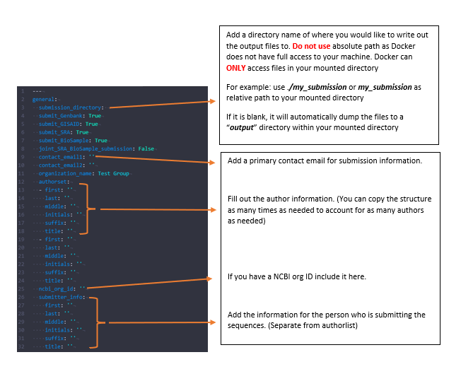
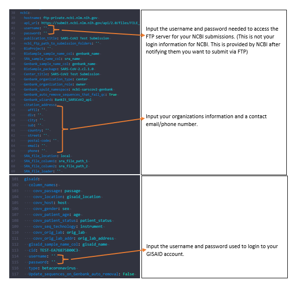
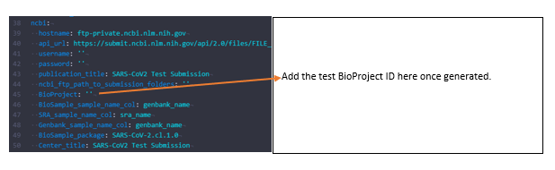

<!-- README.md is generated from README.Rmd. Please edit that file -->

## SeqSender

**SeqSender** is used to generate the files necessary to upload via FTP
to NCBI’s databases **Genbank**, **BioSample**, and **SRA**, as well as,
**GISAID**. The pipeline then automatically performs the sequential
upload to these databases to ensure proper linkage of data. The pipeline
is dynamic in that the user creates a config file to select which
databases they would like to upload and allows for any possible metadata
fields by using a YAML to pair the database’s metadata fields which your
personal metadata field columns. This pipeline is currently tested with
uploading SARS-COV2 data but the dynamic nature of this pipeline will
allow for other organism’s in future updates.

## Dockerize SeqSender Pipeline

### Requirements

  - Docker version \>= 18
  - Git version \>= 2.21.0

### (1) Clone this respitory

    git clone https://github.com/CDCgov/seqsender.git

### (2) CD to `seqsender` folder where `Dockerfile` file is stored and build the docker image.

**NOTE:** `Dockerfile` contains a list of instructions and steps of how
to build and run the `seqsender` pipeline.

    docker build -t seqsender:1.0.0 .

**-t**: add a tag to an image such as the version of the application,
e.g. *seqsender:1.0.0* or *seqsender:latest*

*The image took approximately \< 1 min to build*

### (3) After the build is completed, you can check if the image is built successfully

    docker images
    
    REPOSITORY    TAG       IMAGE ID        CREATED        SIZE
    seqsender     1.0.0     d9e2578d2211    2 weeks ago    1.07GB

### (4) See a list of commands in `seqsender`

    docker run -it seqsender:1.0.0 --help

**-t**: allocate a pseudo-tty <br> **-i**: keep STDIN open even if not
attached <br> **-h, –help**: show help messages and exit

Here is a list of commands in `seqsender`:

``` 

To create the files for submission and adds to automated submission pipeline and starts submission process:
  Usage: seqsender submit [-h] --unique_name <> --fasta <> --metadata <> [--config <>] [--test] [--overwrite]

To create the files for submission:
  Usage: seqsender prep [-h] --unique_name <> --fasta <> --metadata <> [--config <>] [--test] [--overwrite]

To update process of all sequences in submission pipeline, performs submission to subsequent databases based on submission status:
  Usage: seqsender update_submissions [-h]

To output BioProject ID needed to perform test submissions:
  Usage: seqsender test_bioproject [-h] --unique_name <> [--config <>]

To perform manual submission to GISAID:
  Usage: seqsender gisaid [-h] --unique_name <> [--config <>] [--test] [--overwrite]

To perform manual submission to Genbank:
  Usage: seqsender genbank [-h] --unique_name <> [--config <>] [--test] [--overwrite]

To perform manual submission to BioSample:
  Usage: seqsender biosample [-h] --unique_name <> [--config <>] [--test] [--overwrite]

To perform manual submission to SRA:
  Usage: seqsender sra [-h] --unique_name <> [--config <>] [--test] [--overwrite]

To perform manual submission to BioSample/SRA:
  Usage: seqsender biosample_sra [-h] --unique_name <> [--config <>] [--test] [--overwrite]

To authenticate GISAID submissions:
  Usage: gisaid_uploader [-h] [--proxy <>] [--debug] [--version] [-a AUTHFILE] [-t AUTHTOKEN] [-l LOGFILE] ctx {authenticate,upload,revoke} ...

To retrieve a sample file used by seqsender to submit submissions such as config file, metadata file, and required columns file.
  Usage: retrieve --sample_file <> [--outdir <>]

To check status of a submission:
  Usage: check --unique_name <>

Required flags:
  --unique_name <>        Unique identifier
  --metadata <>           Metadata file
  --fasta <>              Fasta file
  --sample_file <>        Name of a file to retrieve: config/metadata/required_columns


Optional flags:
  -h, --help      Show help messages and exit.
  --config <>     If using a different config file than the default config. 
                  Provide the full name of the config file stored in config_files folder.
  --test          Performs test submission to NCBI. Does not perform test submission to GISAID. 
                  You must used authenticated CID for test submission to GISAID.
  --overwrite     Overwrites an existing submission on NCBI FTP. Used to update errored submissions.
  --outdir <>     The output directory to return the file to
  
```

To run an individual command in `seqsender`:

    docker run -v [host_dir]:[container_dir] -it seqsender:1.0.0 seqsender [-h, --help]
                                                                 seqsender submit [-h, --help] ...
                                                                 seqsender prep [-h, --help] ...
                                                                 seqsender update_submissions [-h, --help] ...
                                                                 etc.

**-t**: allocate a pseudo-tty <br> **-i**: keep STDIN open even if not
attached <br> **-v**: mount code base and data files from host directory
to container directory **\[host\_div\]:\[container\_dir\]**. By exposing
the host directory to docker container, docker will be able to access
data files within that mounted directory and use it to run the
`seqsender` pipeline.

For more information about the Docker syntax, see [Docker run
reference](https://docs.docker.com/engine/reference/run/)

### (5) Run `seqsender` using provided datasets

First, make sure **/path/to/seqsender** is set as your present working
directory. If it is not, `cd` to that directory. Within that `seqsender`
directory, there are **test\_input** and **config\_files** subfolders
which contain files that are needed to run the `seqsender` pipeline. The
`seqsender` pipeline will ultilize these files and automatically
generate necessary files to upload via FTP to NCBI’s databases, Genbank,
BioSample, and SRA, as well as, GISAID.

**NOTE:** The instructions in this document **ONLY** attempts to submit
submissions on the **“NCBI’s Test server”** using the `--test` flag. For
production submissions, please remove this flag.

**i.** Finish setting up the config file

Open the test config yaml in **“config\_files/test\_config.yaml”**.
There are user specific fields that must be added to finalize the setup
of this file.





**ii.** Finish setting up the metadata file

After finished setting up the test config yaml, there are two fields in
**“test\_input/test\_metadata.tsv”** that must be updated:
**sra\_file\_path\_1**, **sra\_file\_path\_2**. Open the file and update
the sra file path’s to give a relative path to each of the test input
fastq’s as related to your current working directory.

**NOTE: Do not use absolute paths as Docker does not have full access to
your machine. Docker can **ONLY** access files within your mounted
directory, e.g. /path/to/seqsender**

<table style="width:100%;">

<colgroup>

<col style="width: 50%" />

<col style="width: 50%" />

</colgroup>

<thead>

<tr class="header">

<th>

sra\_file\_path\_1:

</th>

<th>

sra\_file\_path\_2

</th>

</tr>

</thead>

<tbody>

<tr class="odd">

<td>

test\_input/test\_fastq\_R1.fastq <br> or <br>
./test\_input/test\_fastq\_R1.fastq

</td>

<td>

test\_input/test\_fastq\_R2.fastq <br> or <br>
./test\_input/test\_fastq\_R2.fastq

</td>

</tr>

</tbody>

</table>

**iii.** Initialize scripts

Before a submission can be submitted, there are a couple initialization
steps that must be completed. <br>

  - To create a production BioProject, it must be completed on the GUI
    for NCBI. <br>

  - For **test submissions**, Bioproject must be created on the FTP test
    server. To create this, run the command below. After running it,
    wait around \~5 minutes and then run the command again. The script
    will output the test BioProject ID needed to perform the test
    submissions.

**NOTE:** Change ***/path/to/seqsender*** path to your local
***seqsender*** directory and use relative paths for all the files
within your mounted directory, e.g. /path/to/seqsender

    docker run -v /path/to/seqsender/:/submissions-pipeline/ -it seqsender:1.0.0 seqsender test_bioproject --unique_name test_submission --config config_files/test_config.yaml
    
    
    
    Submission reports exists pulling down.
    Test BioProject ID is: <some_bioproject_id>

or

    docker run -v /path/to/seqsender/:/submissions-pipeline/ -it seqsender:1.0.0 seqsender test_bioproject --unique_name test_submission --config ./config_files/test_config.yaml
    
    
    
    Submission reports exists pulling down.
    Test BioProject ID is: <some_bioproject_id>

After receiving the test BioProject ID, you must add it to the
**“test\_config.yaml”**



Next, the GISAID submitter must be authenticated. To authenticate, run
the command below. It will ask you to input a client-id, provide the
TEST client ID (e.g. **TEST-EA76875B00C3**), followed by your GISAID
account username and password.

    docker run -v /path/to/seqsender/:/submissions-pipeline/ -it seqsender:1.0.0 gisaid_uploader COV authenticate
    
    Enter Client-id: TEST-EA76875B00C3
    Enter Username: <enter your GISAID username>
    Enter Password: <enter your GISAID password>

**iv.** Prep the submissions

Before we can perform a submission, we can first run the **“prep”**
command. This will generate all the files necessary for submission to
ensure everything was completed correctly.

**NOTE:** Change ***/path/to/seqsender*** path to your local
***seqsender*** directory and use relative paths for all the files
within your mounted directory, e.g. /path/to/seqsender

    docker run -v /path/to/seqsender/:/submissions-pipeline/ -it seqsender:1.0.0 seqsender prep --unique_name test_submission --config config_files/test_config.yaml --metadata test_input/test_metadata.tsv --fasta test_input/test_fasta.fasta --test

or

    docker run -v /path/to/seqsender/:/submissions-pipeline/ -it seqsender:1.0.0 seqsender prep --unique_name test_submission --config ./config_files/test_config.yaml --metadata ./test_input/test_metadata.tsv --fasta ./test_input/test_fasta.fasta --test

**v.** Perform the submissions

After ensuring that the prep script has worked correctly, you can begin
submitting to the test server for each of the public databases. To
submit to NCBI’s test server, run the following command. This will
submit to SRA and BioSample. The submission will have to process before
it is completed.

**NOTE:** Change ***/path/to/seqsender*** path to your local
***seqsender*** directory and use relative paths for all the files
within your mounted directory, e.g. /path/to/seqsender

    docker run -v /path/to/seqsender/:/submissions-pipeline/ -it seqsender:1.0.0 seqsender submit --unique_name test_submission --config config_files/test_config.yaml --metadata test_input/test_metadata.tsv --fasta test_input/test_fasta.fasta --test

or

    docker run -v /path/to/seqsender/:/submissions-pipeline/ -it seqsender:1.0.0 seqsender submit --unique_name test_submission --config ./config_files/test_config.yaml --metadata ./test_input/test_metadata.tsv --fasta ./test_input/test_fasta.fasta --test

To submit to GISAID test server, run the following command. Upon
completion, if there is no error then the submission is complete.

**NOTE:** Change ***/path/to/seqsender*** path to your local
***seqsender*** directory and use relative paths for all the files
within your mounted directory, e.g. /path/to/seqsender

    docker run -v /path/to/seqsender/:/submissions-pipeline/ -it seqsender:1.0.0 seqsender gisaid --unique_name test_submission --config config_files/test_config.yaml --test

or

    docker run -v /path/to/seqsender/:/submissions-pipeline/ -it seqsender:1.0.0 seqsender gisaid --unique_name test_submission --config ./config_files/test_config.yaml

**vi.** Update the submissions

To check the submission process for NCBI’s test server, run the
following command. This will update the status for each database. Once
BioSample has processed it will then submit the Genbank test submission
automatically. This command can be ran as often as needed till it has
completed.

**NOTE:** Change ***/path/to/seqsender*** path to your local
***seqsender*** directory and use relative paths for all the files
within your mounted directory, e.g. /path/to/seqsender

    docker run -v /path/to/seqsender/:/submissions-pipeline/ -it seqsender:1.0.0 seqsender update_submissions

Once all the submissions are complete then you a ready to start
performing production submissions for all the databases. Contact each
database you intend to submit to and let them know you have successfully
performed a test submission and will begin submitting production
submissions.

<br>

Any questions or issues? Please report them on our [github
issues](https://github.com/CDCgov/seqsender/issues)

<br>
