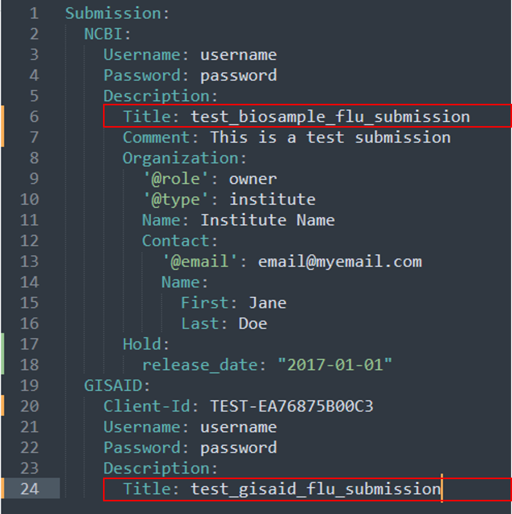

<!-- README.md is generated from README.Rmd. Please edit that file -->

## Overview

**SeqSender** is a Python program that is designed to automate the
process of generating necessary submission files (e.g. submission.xml,
submission.zip, etc.) and then bulk uploading them via FTP to NCBI
archives such as **Genbank**, **BioSample**, and **SRA**. Additionally,
the program can batch uploading submissions of meta- and sequence-data
to **GISAID** using their Command Line Interface Tools (e.g., **EpiFlu**
and **EpiCoV CLI)**. Currently, the pipeline is capable of uploading
**Influenza A Virus** (FLU) and **SARS-COV-2** (COV) data.

## Prerequisites

- **NCBI Submissions**

1.  To submit to NCBI archives such as **BioSample/SRA/Genbank**, you
    will need to request access to an upload directory on NCBI FTP
    server.
2.  Additionally, since `SeqSender` is submitting to NCBI based on a
    UI-Less Data Submission Portal Protocol, you will need to create a
    submission group in NCBI Submission Portal. A group should include
    all individuals who need access to UI-less submissions through the
    web interface. Each member of the group should have an individual
    account. To set-up an account:

> A. Log in at
> <a href="https://submit.ncbi.nlm.nih.gov" target="_blank">https://submit.ncbi.nlm.nih.gov</a>
> (Log in button is in the upper right corner)  
> B. Click on your user name in the upper right corner to update your
> profile  
> C. Fill-in your profile and click Save  
> D. If you registered for direct NCBI account, validate your email

3.  Coordinate with NCBI to create a namespace name
    (**spuid_namespace**) that will be used in Submitter Provided Unique
    Identifiers (**SPUIDs**) prior to submission.

- **GISAID Submissions**

1.  For GISAID submissions, you will need an GISAID account and then
    request a client-ID to submit to **EpiFlu** or **EpiCoV** database.
    Please email
    <a href="mailto:clisupport@gisaid.org">clisupport@gisaid.org</a> to
    obtain those credentials.

2.  Lastly, to submit to EpiFlu database, download EpiFlu CLI (batch
    upload package) from GISAID. Otherwise, to perform EpiCoV
    submissions, download EpiCoV CLI.

## Preparations

After you have completed the prerequisites, you can start prepping for
the essential files (such as the metadata worksheet, fasta file, raw
read files, etc.) that would allow `SeqSender` to pull in required
fields to generate submission files and batch uploading them to your
desired database.

1.  Prepping for FLU submissions

   -
<a href="biosample_flu_required_fields.html" target="_blank">BioSample</a>

   - <a href="sra_flu_required_fields.html" target="_blank">SRA</a>

   -
<a href="biosample_sra_flu_required_fields.html" target="_blank">BioSample +
SRA</a>

   -
<a href="genbank_flu_required_fields.html" target="_blank">Genbank</a>

   -
<a href="gisaid_flu_required_fields.html" target="_blank">GISAID</a>

2.  Prepping for COV submissions

   -
<a href="biosample_cov_required_fields.html" target="_blank">BioSample</a>

   - <a href="sra_cov_required_fields.html" target="_blank">SRA</a>

   -
<a href="biosample_sra_cov_required_fields.html" target="_blank">BioSample +
SRA</a>

   -
<a href="genbank_cov_required_fields.html" target="_blank">Genbank</a>

   -
<a href="gisaid_cov_required_fields.html" target="_blank">GISAID</a>

## Run SeqSender with Docker CLI

### Software requirements

- Docker version \>= 20.10.14
- Git version \>= 2.21.0

### (1) Clone `SeqSender` repo under the `dev` branch

``` bash
git clone https://github.com/CDCgov/seqsender.git --reference dev
```

### (2) Navigate to `SeqSender` folder where `Dockerfile` file is stored and build its docker image

``` bash
docker build -t seqsender:latest .
```

**-t**: add a tag to an image, e.g. *seqsender:1.0.0* or
*seqsender:latest*

### (3) After the build is completed, you can check if the image is built successfully

``` bash
docker images

REPOSITORY    TAG       IMAGE ID        CREATED        SIZE
seqsender     latest    d9e2578d2211    2 weeks ago    1.08GB
```

### (4) Run `SeqSender` container

``` bash
docker run \
-v /path/to/data:/data \
-t -d seqsender:latest \
--name seqsender
```

**-t**: allocate a pseudo-tty <br> **-d**: run the container in detached
mode <br> **-v**: mount data files from host directory to container
directory **\[host_div\]:\[container_dir\]**. By exposing the host
directory to docker container, docker will be able to access data files
within that mounted directory and use it to fire up the `SeqSender`
workflows. <br> **`--`name**: give an identity to the container <br>

For more information about the Docker syntax, see
<a href="https://docs.docker.com/engine/reference/run/" target="_blank">Docker
run reference</a>

To check if the container is built successfully

``` bash
docker container ps


CONTAINER ID   IMAGE                COMMAND        CREATED         STATUS        PORTS      NAMES
b37b6b19c4e8   seqsender:latest     "/bin/bash"    5 hours ago     Up 5 hours               seqsender
```

### (5) See a list of commands in `SeqSender` container

``` bash
docker exec -it seqsender bash seqsender-kickoff --help
```

**-t**: allocate a pseudo-tty <br> **-i**: keep STDIN open even if not
attached <br> **-h, –help**: show help messages and exit

``` bash
usage: seqsender.py [-h] {authenticate,biosample,sra,biosample_sra,genbank,gisaid,check_submission_status,template,version} ...

Automatic process of submitting samples to BioSample/SRA/BioSample+SRA/GenBank/GISAID for FLU/COV organism

positional arguments:
  {authenticate,biosample,sra,biosample_sra,genbank,gisaid,check_submission_status,template,version}
    authenticate        Generates an authentication-token and store it for future submissions
    biosample           Creates submission files and begins automated process of submitting to BioSample database.
    sra                 Creates submission files and begins automated process of submitting to SRA database.
    biosample_sra       Creates submission files and begins automated process of submitting to BioSample+SRA databases.
    genbank             Creates submission files and begins automated process of submitting to GenBank database.
    gisaid              Creates submission files and begins automated process of submitting to GISAID database.
    check_submission_status
                        Check existing process of submissions using submission log.
    template            Return a zip file containning config file, metadata file, fasta files, etc., that can be used to make a test
                        submission
    version             Show version and exit

optional arguments:
  -h, --help            show this help message and exit
```

### (6) Upload a submission using `SeqSender` container

**i.** Download a submission template for **BioSample-FLU**

``` bash
docker exec -it seqsender bash seqsender-kickoff template --database BioSample --organism FLU
```

***NOTE:** A zip template will be generated and stored at your mounted
data directory, e.g. **/data/template/BioSample-FLU-template.zip**. You
will need to unzip that file and finish setting-up the config file as
instructed in step (**ii**)*

**ii.** Set up the config file

Open the config yaml file at
**“/data/template/BioSample-FLU-template/config.yaml”**. There are user
specific fields that must be filled-in prior to submission.

<a href="man/figures/config_file.png" target="_blank"></a>

**iii.** Submit to **NCBI-BioSample-FLU**

``` bash
docker exec -it seqsender bash seqsender-kickoff biosample --organism FLU --config_file /data/template/BioSample-FLU-template/config.yaml --metadata_file /data/template/BioSample-FLU-template/metadata.csv --test
```

***NOTE:** The instruction in this document **ONLY** attempts to submit
to **“Test server”** using `--test` flag. For **Production**
submissions, please remove this flag.*

Similarly, to submit to other databases (e.g., **SRA**,
**BioSample+SRA**, **GenBank**, **GISAID**), you can download the
submission template for that database and repeat steps (**i**) and
(**ii**) and (**iii**)

### (7) Check status of a submission using `SeqSender` container

For **NCBI**, after a submission is submitted, you can routinely check
the process of the submission.

Here is a list of submission statuses and its meanings:

> 1.  If at least one action has **Processed-error**, submission status
>     is **Processed-error**
> 2.  Otherwise if at least one action has **Processing** state, the
>     whole submission is **Processing**
> 3.  Otherwise, if at least one action has **Queued** state, the whole
>     submission is **Queued**
> 4.  Otherwise, if at least one action has **Deleted** state, the whole
>     submission is **Deleted**
> 5.  If all actions have **Processed-ok**, submission status is
>     **Processed-ok**
> 6.  Otherwise submission status is **Submitted**

``` bash
docker exec -it seqsender bash seqsender-kickoff check_submission_status --database BioSample --organism FLU --submission_name test_biosample_flu --test
```

***NOTE:** The **submission_name** flag above is referred to the
**submission title** that is defined in your config file.*

<a href="man/figures/config_file_title.png" target="_blank"></a>

<br><br>

Any questions or issues? Please report them on our
<a href="https://github.com/CDCgov/seqsender/issues" target="_blank">github
issues</a>

<br>
