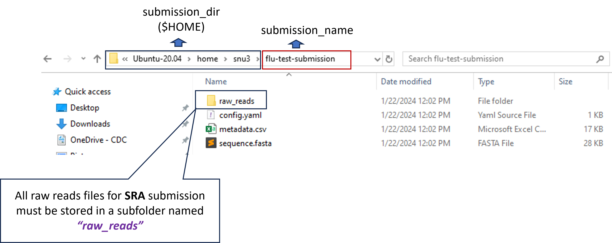
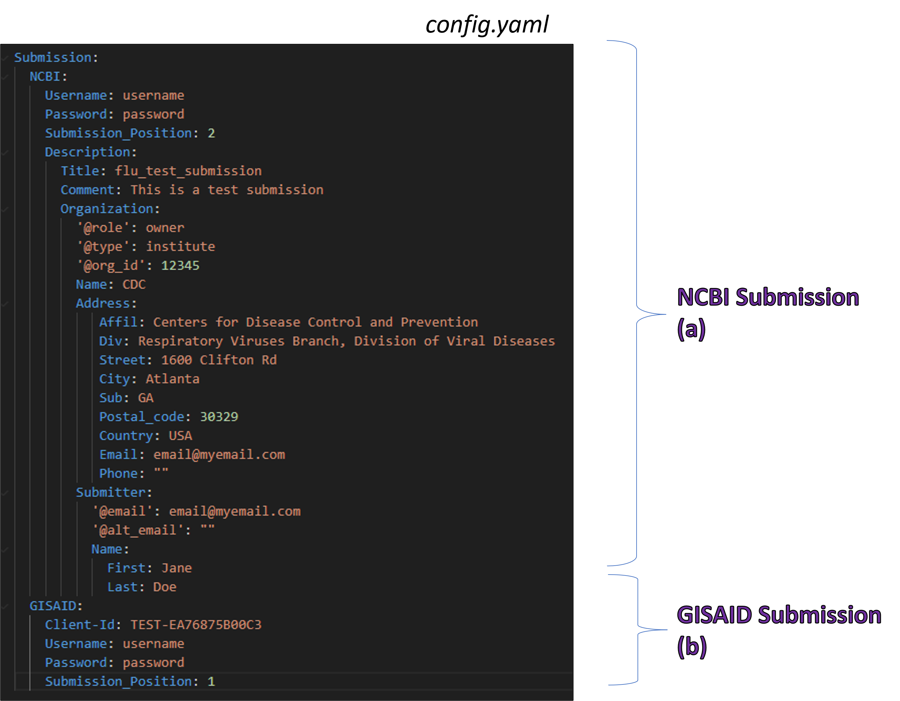

<style>
  
  table {
    border: none;
  }
  
  td, th, tr {
    border: 1px solid gray;
    padding: 5px 5px 5px 5px;
  }

</style>

```{r, include=FALSE, echo=FALSE, message=FALSE, warning=FALSE}
# R libraries
library(knitr) # for html table
library(yaml)  # for yaml file
library(tidyverse) # for pipe
library(reshape2) # for data manipulation

# Read in the DESCRIPTION file
description <- yaml::read_yaml("../DESCRIPTION")

# Define variables
program <- description$Package
title <- "GenBank"
prefix <- "gb-"
portals <- c("NCBI", "NCBI", "NCBI", "GISAID", "GISAID")
databases <- c("BIOSAMPLE", "SRA", "GENBANK", "FLU", "COV")
organism <- c("Influenza A Virus", "SARS-COV-2")
organism_abbrev <- c("FLU", "COV")

# Define github repo
github_repo <- description$URL

# Define github pages URL
github_pages_url <- description$GITHUB_PAGES
  
# Create main config data frame  
main_config_df <- data.frame(
  portals = portals,
  databases = databases
) %>% 
dplyr::filter(
  databases %in% toupper(!!title)
)

# Read in data files
main_config_file <- yaml::read_yaml("../config/main_config.yaml")

# Store all required fields
metadata_df <- reshape2::melt(main_config_file$SUBMISSION_PORTAL$COMMON_FIELDS) %>% 
  dplyr::transmute(
    Column_name = gsub("[*&?#]", "", L1),
    Description = value
  )

# Combine all fields in given databases and portals
for(d in 1:nrow(main_config_df)){
  #d=1
  database <- main_config_df$databases[d]
  portal <- main_config_df$portals[which(main_config_df$databases %in% database)]
  
  if("COMMON_FIELDS" %in% names(main_config_file$SUBMISSION_PORTAL$PORTAL_NAMES[[portal]])){
    portal_fields <- reshape2::melt(main_config_file$SUBMISSION_PORTAL$PORTAL_NAMES[[portal]]$COMMON_FIELDS) %>% 
      dplyr::transmute(
        Column_name = gsub("[*&?#]", "", L1),
        Description = value
      )
    
    metadata_df <- metadata_df %>% 
      dplyr::bind_rows(portal_fields) %>% 
      dplyr::distinct(.keep_all = TRUE)
    
  }
  
  database_fields <- reshape2::melt(main_config_file$SUBMISSION_PORTAL$PORTAL_NAMES[[portal]]$DATABASE[[database]]) %>% 
    dplyr::transmute(
      Column_name = gsub("[*&?#]", "", L1),
      Description = value
    )
  
  metadata_df <- metadata_df %>% 
    dplyr::bind_rows(database_fields) %>% 
    dplyr::distinct(.keep_all = TRUE)
  
}
```

## Overview

The **GenBank** sequence database is an open access, annotated collection of all publicly available nucleotide sequences and their protein translations. It is produced and maintained by the **National Center for Biotechnology Information** (NCBI; a part of the **National Institutes of Health** in the United States) as part of the **International Nucleotide Sequence Database Collaboration (INSDC)**. 

Before submitters can batch uploading meta- and sequence-data to **`r title`** database using ``r program``, they must ensure the requirement files (such as `config.yaml`, `metadata.csv`, `sequence.fasta`, `raw reads`, etc.) are already prepared ahead of time and stored them in a submission folder of choice (e.g., `submission_name`) within a parent submission directory (e.g., `submission_dir`). That way ``r program`` will be able to scoop up the necessary files in that folder, generate submission files, and then batch uploading them to the submitting database of choices.

## Requirement files

- [Config file](#config-file) in a `yaml` format
- [Fasta file](#fasta-file) in a`fasta` format
- [Metadata file](#metadata-file) in a `csv` format

A quick look of where to store all of the requirement files



### Config file

Config file is a yaml file that provides a brief description about the submission and contains user credentials that allow ``r program`` to authenticate the database prior to upload a submission.



:::{style="padding: 10px; border: 1px solid blue !important;"}

<i class="fas fa-triangle-exclamation" role="presentation" aria-label="triangle-exclamation icon"></i> **NOTE:** <br>

- To submit to NCBI only, one can remove the **GISAID Submission (b)** section from the config file. Vice versa, to submit to GISAID only, just remove the **NCBI Submission (a)** section. <br>
- **Submission_Position** determines the order of databases in which we will submit to first. For instance, if GISAID is set as `1`, **_`r program`_** will submit to GISAID first, then after all samples are assigned with a GISAID accession number, **_`r program`_** will proceed to submit to NCBI. This order of submission ensures samples are linked correctly between the two databases. <br> 
- **Username** and **Password** under the **NCBI Submission (b)** section are the credentials used to authenticate the **NCBI FTP Server** (not to mistake with individual NCBI account). See [PRE-REQUISITES](`r github_pages_url`/index.html#prerequisites) for more details.
:::

### Fasta file

Fasta file contains nucleotide sequences for all samples. See [Genbank Fasta Format](https://www.ncbi.nlm.nih.gov/genbank/fastaformat/) for more details.

### Metadata file

The metadata worksheet is a comma-delimited (csv) file that contains required attributes that are useful for the rapid analysis and trace back of **`r paste0(organism, collapse=" or ")`** cases.

Here is a short description about the fields in the metadata worksheet.

```{r include=TRUE, echo=FALSE, message=FALSE, warning=FALSE}
knitr::kable(metadata_df, format = "html", row.names = FALSE, escape = FALSE)
```

<br>

**NOTE:** The prefix of **“`r prefix`”** is used to identity attributes for **`r title`** submissions. The prefix of **“src-”** is used to identity attributes for **Source Information Table**. Likewise, the prefix of **“cmt-”** is used to identity attributes for **Structured Comment Table**.

To include additional attributes to **Source Information table**, just append `src-` in front of the desired attributes, e.g. `src-subtype`, `src-passage`, etc. See [Genbank Source Table Modifier](https://www.ncbi.nlm.nih.gov/WebSub/html/help/genbank-source-table.html#modifiers) for more details.

To include additional attributes to **Structured Comment Table**, just append `cmt-` in front of the desired attributes, and most importantly, the fields must be sandwiched between `cmt-StructuredCommentPrefix` and `cmt-StructuredCommentSuffix`. For examples,  `cmt-StructuredCommentPrefix`, `cmt-Assembly Method`, `cmt-Coverage`, `...`, `cmt-Sequencing Technology`, `cmt-StructuredCommentSuffix`. See [Genbank Structured Comment](https://www.ncbi.nlm.nih.gov/genbank/structuredcomment/#GenBank) for more details.

<br><br>

<p style="font-size: 20px">[*<i class="fas fa-play" role="presentation" aria-label="play icon"></i> You are now ready to install ``r program`` and batch upload your submission*](`r github_pages_url`/articles/local_installation.html)</p>

<br><br><br>

Any questions or issues? Please report them on our <a href="`r github_repo`/issues" target="_blank">Github issue tracker</a>.

<br>

