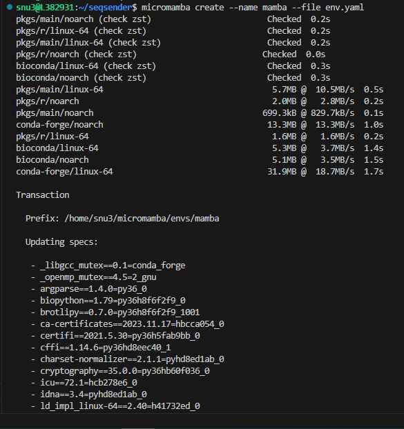
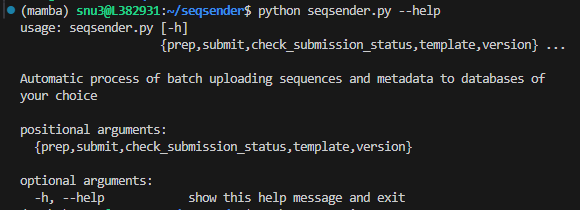
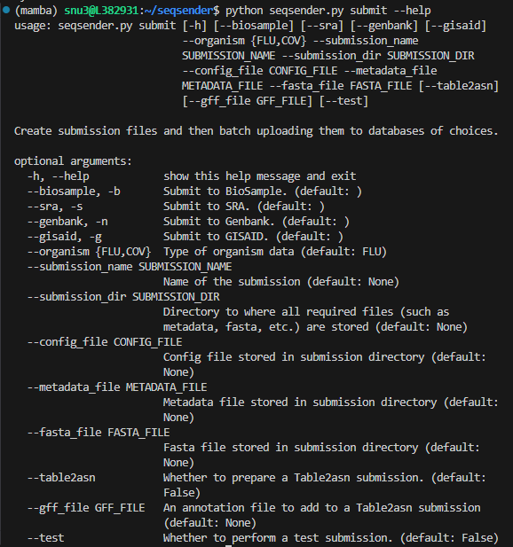
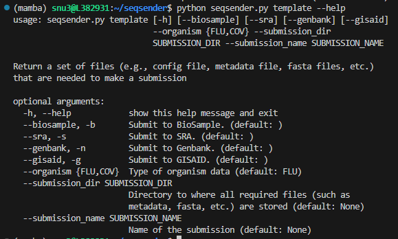

```{r include=FALSE, echo=FALSE, message=FALSE, warning=FALSE}
# R libraries
library(yaml)  # for yaml file

# Read in the DESCRIPTION file
description <- yaml::read_yaml("../DESCRIPTION")

# Define variables
program <- description$Package

# Define github repo
github_repo <- description$URL

# Define github pages URL
github_pages_url <- description$GITHUB_PAGES
```

<script type="text/javascript">
  
  function ToggleOperation(id) {
    var x = document.getElementById(id+"-block");
    if (x.style.display === "none") {
      x.style.display = "block";
    } else {
      x.style.display = "none";
    }
  }

</script>

**SOFTWARE REQUIREMENTS:** 

- Linux (64-bit) or Mac OS X (64-bit)
- Git version 2.25.1 or later
- Standard utilities: curl, tar, unzip

**ADDITIONAL REQUIREMENTS:** 

See [PRE-REQUISITES](`r github_pages_url`/index.html#prerequisites) and [REQUIREMENT FILES](`r github_pages_url`/index.html#requirement-files) before proceeding to the next steps

## Micromamba Installation

Here we recommend using **micromamba** to set up a virtual environment to run ``r program``. **Micromamba** is a tiny, statically linked C++ reimplementation of mamba which is an alternative to conda. The tool works as a standalone package manager that supports a subset of all mamba or conda commands, but it also has its own separate command line interfaces. For more information, visit [micromamba documentation](https://mamba.readthedocs.io/en/latest/user_guide/micromamba.html).

To manually install, download and unzip the executable from the official **conda-forge** package to your `$HOME` directory using `tar`. 

```bash
cd $HOME
```

- LINUX

```bash
# Linux Intel (x86_64):
curl -Ls https://micro.mamba.pm/api/micromamba/linux-64/latest | tar -xvj bin/micromamba
# Linux ARM64:
curl -Ls https://micro.mamba.pm/api/micromamba/linux-aarch64/latest | tar -xvj bin/micromamba
# Linux Power:
curl -Ls https://micro.mamba.pm/api/micromamba/linux-ppc64le/latest | tar -xvj bin/micromamba
```

- macOS

```bash
# macOS Intel (x86_64):
curl -Ls https://micro.mamba.pm/api/micromamba/osx-64/latest | tar -xvj bin/micromamba
# macOS Silicon/M1 (ARM64):
curl -Ls https://micro.mamba.pm/api/micromamba/osx-arm64/latest | tar -xvj bin/micromamba
```

After the extraction is completed, you can find the executable at `$HOME/bin/micromamba`

- To quickly use `micromamba`, you can simply run

```bash
export MAMBA_ROOT_PREFIX="$HOME/micromamba"
eval "$($HOME/bin/micromamba shell hook -s posix)"
```

- To persist using `micromamba`, you can append the following script to your `.bashrc` (or `.zshrc`) 

```bash
# >>> mamba initialize >>>
export MAMBA_EXE="$HOME/bin/micromamba";
export MAMBA_ROOT_PREFIX="$HOME/micromamba";
__mamba_setup="$("$MAMBA_EXE" shell hook --shell bash --root-prefix "$MAMBA_ROOT_PREFIX" 2> /dev/null)"
if [ $? -eq 0 ]; then
    eval "$__mamba_setup"
else
    alias micromamba="$MAMBA_EXE"  # Fallback on help from mamba activate
fi
unset __mamba_setup
# <<< mamba initialize <<<
```

- To check the current version of `micromamba`

```bash
micromamba --version
1.5.6
```

## Set up a `micromamba` environment

1. Clone this repository to your `$HOME` directory

```bash
cd $HOME
git clone `r github_repo`.git
```

2. `CD` to  **seqsender** folder where the `env.yaml` file is stored. Let's create a virtual environment named **mamba** that contains all dependencies needed to run ``r program`` from the source file.

```bash
cd seqsender
micromamba create --name mamba --file env.yaml
```



3. Activate the named environment -- **mamba**

```bash
micromamba activate mamba
```

## Run ``r program`` within the `mamba` environment

First, let's look a list of commands in ``r program``. Currently, there are five implemented commands in ``r program``: `prep`, `submit`, `check_submission_status`, `template`, `version`.

```bash
python seqsender.py --help
```


<br>

To see the arguments required for each command, for example, the `submit` command, run

```bash
python seqsender.py submit --help
```




## Submit a `test` submission

Rather than hastily jump in and submit a `production` submission right away, we can utilize GISAID's and NCBI's **“TEST-SERVER”** to upload a `test` submission first. That way submitter can familiarize themselves with the submission process prior to make a real submission. 

**Note** Duplicate test submissions will result in an error. Please create new sequence names each time you plan to run test submissions to avoid this issue. 

### <a onclick="ToggleOperation('projects')"><i class="fas fa-play" role="presentation" aria-label="play icon"></i> Submit a `test` submission with a pre-processed dataset</a>

<div id="projects-block" style="display: none;">

Here we will go over the steps of preparing and batch uploading meta- and sequence-data to GISAID and NCBI databases using a pre-processed dataset provided with the software. 

The `template` command will allow you to output examples of metadata and config files so you can base your submission on prior to upload a real submission. To get more help on the command, run 

```bash
python seqsender.py template --help
```


<br>

#### 1. Download the pre-processed meta- and sequence-data

```bash
python seqsender.py template \
--organism FLU \
-bsng \
--submission_dir $HOME \
--submission_name flu-test-submission
```

- **`--organism`** specifies the type of data to download. Currently, **Influenza A Virus** (FLU) and **SARS-COV-2** (COV) are the only two options. Additional datasets for other organisms will be provided in future updates or requests. <br>
- **`-bsng`** is a combination flag of databases: **Biosample** *(`-b` or `--biosample`)*, **SRA** *(`-s` or `--sra`)*, **Genbank** *(`-n` or `--genbank`)*, and **GISAID** *(`-g` or `--gisaid`)*. This combination flag tells ``r program`` to generate an unified meta- and sequence-data into one file so we can perform batch upload to all databases simultaneously. <br>
- **`--submission_dir`** is the directory where you would like to dump all the submission files. <br>
- **`--submission_name`** is the submission folder inside the `--submission_dir` directory where it contains all necessary files (such as *config.yaml*, *metadata.csv*, *sequence.fasta*, *raw reads*, etc.) in order to make a submission.

A quick look at the output files:


Here is the standard out of the command.

```text
Generating submission template
Files are stored at: /home/snu3/flu-test-submission

Total runtime (HRS:MIN:SECS): 0:00:00.115140
```


#### 2. Set up the config file -- `config.yaml`

After the template is downloaded in `(1)`, you can find `config.yaml` in your local `$HOME/flu-test-submission` directory. The `config.yaml` yaml file provides a brief description about the submission and contains user credentials that allow ``r program`` to authenticate the database prior to upload a submission. 

Open that file with a text editor of your choice and fill in the appropriate information about your submission. 


:::{style="padding: 10px; border: 1px solid blue !important;"}
<i class="fas fa-triangle-exclamation" role="presentation" aria-label="triangle-exclamation icon"></i> **NOTE:** <br>

- To submit to NCBI only, one can remove the **GISAID Submission (b)** section from the config file. Vice versa, to submit to GISAID only, just remove the **NCBI Submission (a)** section. <br>
- **Submission_Position** determines the order of the database in which we will submit first. For instance, if GISAID is set as `1`, ``r program`` will submit to GISAID first, then after all samples are assigned with a GISAID accession number, ``r program`` will proceed to submit to NCBI. This order of submission ensures samples are linked correctly between the two databases after submission. <br> 
- **Username** and **Password** under the **NCBI Submission (b)** section are the credentials used to authenticate the **NCBI FTP Server** (not to mistake with individual NCBI account). See [PRE-REQUISITES](`r github_pages_url`/articles/index.html#prerequisites) for more details.
:::

:::{style="padding: 10px; border: 1px solid blue !important;"}
<i class="fas fa-triangle-exclamation" role="presentation" aria-label="triangle-exclamation icon"></i> **ADDITIONAL REQUIREMENTS:** <br>

- If **SRA** is in your list of submitting databases, the raw reads for all samples must be provided and stored in a subfolder called `raw_reads` inside your submission directory of choice.
- If **GISAID** is in your list of submitting databases, download the CLI package that associated with your organism of interest (e.g, <a href="images/fluCLI_download.png" target="_blank">**Influenza A Virus** (FLU)</a> or <a href="images/covCLI_download.png" target="_blank">**SARS-COV-2** (COV)</a>) from the GISAID platform and stored them in a subfolder called `gisaid_cli` inside your submission directory of choice. 

A quick look of where to store the downloaded **GISAID CLI** package,


_**Important:** Make sure you binary CLI package are executable. To allow executable permissions, run_
```bash
chmod a+x <your_gisaid_cli_file>
```
:::

<br>

#### 3. Upload a test submission

```bash
python seqsender.py submit \
--organism FLU \
-bsng \
--submission_dir $HOME \
--submission_name flu-test-submission \
--config_file config.yaml \
--metadata_file metadata.csv \
--fasta_file sequence.fasta \
--test
```

- **`--organism`** specifies the type of data to upload. Currently, **Influenza A Virus** (FLU) and **SARS-COV-2** (COV) are the only two options. <br>
- **`-bsng`** is a combination flag of databases: **Biosample** *(`-b` or `--biosample`)*, **SRA** *(`-s` or `--sra`)*, **Genbank** *(`-n` or `--genbank`)*, and **GISAID** *(`-g` or `--gisaid`)*. This combination flag tells ``r program`` to prep and submit to each given database. See `python seqsender.py submit --help` for more details. <br>
- **`--submission_dir`** is the directory where you store all of the submission histories. <br>
- **`--submission_name`** is the submission folder inside the `--submission_dir` directory where it contains all necessary files (such as *config.yaml*, *metadata.csv*, *sequence.fasta*, *raw reads*, etc.) in order to make a submission. <br>
- **`--config_file`** is the config file inside the `--submission_name` directory. <br> 
- **`--metadata_file`** is the metadata file inside the `--submission_name` directory. <br> 
- **`--fasta_file`** is the fasta file inside the `--submission_name` directory. <br>
- **`--test`** is used to submit to **“TEST-SERVER ONLY”** . For `production` submission, please remove this flag.

A quick look at the standard output.

```text
Creating submission files for BIOSAMPLE
Files are stored at: /home/snu3/flu-test-submission/submission_files/BIOSAMPLE

Creating submission files for SRA
Files are stored at: /home/snu3/flu-test-submission/submission_files/SRA

Creating submission files for GENBANK
Files are stored at: /home/snu3/flu-test-submission/submission_files/GENBANK

Creating submission files for GISAID
Files are stored at: /home/snu3/flu-test-submission/submission_files/GISAID

Uploading submission files to NCBI-BIOSAMPLE
Performing a 'Test' submission
If this is not a 'Test' submission, interrupts submission immediately.

Connecting to NCBI FTP Server
Submission name: rc-flu-test-submission
Submitting 'rc-flu-test-submission'

Uploading submission files to NCBI-SRA
Performing a 'Test' submission
If this is not a 'Test' submission, interrupts submission immediately.

Connecting to NCBI FTP Server
Submission name: rc-flu-test-submission
Submitting 'rc-flu-test-submission'

Uploading submission files to GISAID-FLU
Performing a 'Test' submission with Client-Id: TEST-EA76875B00C3
If this is not a 'Test' submission, interrupts submission immediately.

Submission attempt: 1
Uploading successfully
Status report is stored at: /home/snu3/flu-test-submission/submission_report_status.csv
Log file is stored at: /home/snu3/flu-test-submission/submission_files/GISAID/gisaid_upload_log_attempt_1.txt
```

#### 4. Check the status of a submission

After a submission is submitted, you can routinely check the status of the submission.

```bash
python seqsender.py check_submission_status \
--organism FLU \
--submission_dir $HOME \
--submission_name flu-test-submission \
--test
```

- **`--organism`** specifies the type of data. Currently, **Influenza A Virus** (FLU) and **SARS-COV-2** (COV) are the only two options. <br>
- **`--submission_dir`** is the directory where you store all of the submission histories. <br>
- **`--submission_name`** is the submission folder inside the `--submission_dir` directory where it contains all necessary files (such as *config.yaml*, *metadata.csv*, *sequence.fasta*, *raw reads*, etc.) in order to make a submission. <br>
- **`--test`** is used to submit to **“TEST-SERVER ONLY”** . For `production` submission, please remove this flag.

Here is a quick look at the standard output:

```text
Checking submission status for:

Submission name: flu-test-submission
Submission organism: FLU
Submission type: Test

Submission database: GISAID
Submission status: processed-ok

Submission database: BIOSAMPLE
Pulling down report.xml
Submission status: submitted

Submission database: SRA
Pulling down report.xml
Submission status: submitted

Submission database: GENBANK
Submission status: ---

Total runtime (HRS:MIN:SECS): 0:00:08.213955
```

Here is a list of submission statuses and its meanings:

> 1. If at least one action has **Processed-error**, submission status is **Processed-error** <br>
> 2. Otherwise if at least one action has **Processing** state, the whole submission is **Processing** <br>
> 3.  Otherwise, if at least one action has **Queued** state, the whole submission is **Queued** <br>
> 4.  Otherwise, if at least one action has **Deleted** state, the whole submission is **Deleted** <br>
> 5.  If all actions have **Processed-ok**, submission status is **Processed-ok** <br>
> 6.  Otherwise submission status is **Submitted**

<br>

</div>

### <a onclick="ToggleOperation('chemicals')"><i class="fas fa-play" role="presentation" aria-label="play icon"></i> Submit a `test` submission with your own dataset</a>

<div id="chemicals-block" style="display: none;">

Before you can perform a `test` submission with your own dataset, make sure you have the required files (such as **config.yaml**, **metadata.csv**, **sequence.fasta**, **raw reads**, etc.) already prepared and stored in the submission directory of your choice. 

<br>

#### 1. Assemble your meta- and sequence-data

(a) To prep for FLU submissions, select one of the databases below for more details

> <a href="`r github_pages_url`/articles/biosample_submission.html" target="_blank">BioSample</a> <br>
> <a href="`r github_pages_url`/articles/sra_submission.html" target="_blank">SRA</a> <br>
> <a href="`r github_pages_url`/articles/genbank_submission.html" target="_blank">Genbank</a> <br>
> <a href="`r github_pages_url`/articles/gisaid_flu_required_fields.html" target="_blank">GISAID</a> <br>
> <a href="`r github_pages_url`/articles/multiple_databases_submission.html" target="_blank">Multiple databases</a>

(b) To prep for COV submissions, select one of the databases below for more details 

> <a href="`r github_pages_url`/articles/biosample_submission.html" target="_blank">BioSample</a> <br>
> <a href="`r github_pages_url`/articles/sra_submission.html" target="_blank">SRA</a> <br>
> <a href="`r github_pages_url`/articles/genbank_submission.html" target="_blank">Genbank</a> <br>
> <a href="`r github_pages_url`/articles/gisaid_cov_submission.html" target="_blank">GISAID</a> <br>
> <a href="`r github_pages_url`/articles/multiple_databases_submission.html" target="_blank">Multiple databases</a>

After you have finished prepping for your database of choices in `(a)` or `(b)`, create a submission folder and store all your metadata and sequence files there.

Here is a quick look at the folder structure


Finally, make sure additional requirements below are met before you can proceed to the next steps.

:::{style="padding: 10px; border: 1px solid blue !important;"}
- If **SRA** is in your list of submitting databases, the raw reads for all samples must be provided and stored in a subfolder called `raw_reads` inside your submission directory of choice.
- If **GISAID** is in your list of submitting databases, download the CLI package that associated with your organism of interest (e.g, <a href="images/fluCLI_download.png" target="_blank">**Influenza A Virus** (FLU)</a> or <a href="images/covCLI_download.png" target="_blank">**SARS-COV-2** (COV)</a>) from the GISAID platform and stored them in a subfolder called `gisaid_cli` inside your submission directory of choice. 

Here is an example of where to place the **GISAID CLI** package.


_**Important:** Make sure you binary CLI package are executable. To allow executable permissions, run_

```bash
chmod a+x <your_gisaid_cli_file>
```
:::

<br>

#### 2. Upload a test submission

After all files are (i) are prepared, we can go ahead and upload the submission

```bash
python seqsender.py submit \
--organism FLU \
-bsng \
--submission_dir $HOME \
--submission_name flu-test-submission \
--config_file config.yaml \
--metadata_file metadata.csv \
--fasta_file sequence.fasta \
--test
```

- **`--organism`** specifies the type of data to upload. Currently, **Influenza A Virus** (FLU) and **SARS-COV-2** (COV) are the only two options. <br>
- **`-bsng`** is a combination flag of databases: **Biosample** *(`-b` or `--biosample`)*, **SRA** *(`-s` or `--sra`)*, **Genbank** *(`-n` or `--genbank`)*, and **GISAID** *(`-g` or `--gisaid`)*. This combination flag tells ``r program`` to prep and submit to each given database. See `python seqsender.py submit --help` for more details. <br>
- **`--submission_dir`** is the directory where you store all of the submission histories. <br>
- **`--submission_name`** is the submission folder inside the `--submission_dir` directory where it contains all necessary files (such as *config.yaml*, *metadata.csv*, *sequence.fasta*, *raw reads*, etc.) in order to make a submission. <br>
- **`--config_file`** is the config file inside the `--submission_name` directory. <br> 
- **`--metadata_file`** is the metadata file inside the `--submission_name` directory. <br> 
- **`--fasta_file`** is the fasta file inside the `--submission_name` directory. <br>
- **`--test`** is used to submit to **“TEST-SERVER ONLY”** . For `production` submission, please remove this flag.

A quick look at the standard output.

```text
Creating submission files for BIOSAMPLE
Files are stored at: /home/snu3/flu-test-submission/submission_files/BIOSAMPLE

Creating submission files for SRA
Files are stored at: /home/snu3/flu-test-submission/submission_files/SRA

Creating submission files for GENBANK
Files are stored at: /home/snu3/flu-test-submission/submission_files/GENBANK

Creating submission files for GISAID
Files are stored at: /home/snu3/flu-test-submission/submission_files/GISAID

Uploading submission files to NCBI-BIOSAMPLE
Performing a 'Test' submission
If this is not a 'Test' submission, interrupts submission immediately.

Connecting to NCBI FTP Server
Submission name: rc-flu-test-submission
Submitting 'rc-flu-test-submission'

Uploading submission files to NCBI-SRA
Performing a 'Test' submission
If this is not a 'Test' submission, interrupts submission immediately.

Connecting to NCBI FTP Server
Submission name: rc-flu-test-submission
Submitting 'rc-flu-test-submission'

Uploading submission files to GISAID-FLU
Performing a 'Test' submission with Client-Id: TEST-EA76875B00C3
If this is not a 'Test' submission, interrupts submission immediately.

Submission attempt: 1
Uploading successfully
Status report is stored at: /home/snu3/flu-test-submission/submission_report_status.csv
Log file is stored at: /home/snu3/flu-test-submission/submission_files/GISAID/gisaid_upload_log_attempt_1.txt
```

#### 3. Check the status of a submission

After a submission is submitted, you can routinely check the status of the submission.

```bash
python seqsender.py check_submission_status \
--organism FLU \
--submission_dir $HOME \
--submission_name flu-test-submission \
--test
```

- **`--organism`** specifies the type of data. Currently, **Influenza A Virus** (FLU) and **SARS-COV-2** (COV) are the only two options. <br>
- **`--submission_dir`** is the directory where you store all of the submission histories. <br>
- **`--submission_name`** is the submission folder inside the `--submission_dir` directory where it contains all necessary files (such as *config.yaml*, *metadata.csv*, *sequence.fasta*, *raw reads*, etc.) in order to make a submission. <br>
- **`--test`** is used to submit to **“TEST-SERVER ONLY”** . For `production` submission, please remove this flag.

Here is a quick look at the standard output:

```text
Checking submission status for:

Submission name: flu-test-submission
Submission organism: FLU
Submission type: Test

Submission database: GISAID
Submission status: processed-ok

Submission database: BIOSAMPLE
Pulling down report.xml
Submission status: submitted

Submission database: SRA
Pulling down report.xml
Submission status: submitted

Submission database: GENBANK
Submission status: ---

Total runtime (HRS:MIN:SECS): 0:00:08.213955
```

Here is a list of submission statuses and its meanings:

> 1. If at least one action has **Processed-error**, submission status is **Processed-error** <br>
> 2. Otherwise if at least one action has **Processing** state, the whole submission is **Processing** <br>
> 3.  Otherwise, if at least one action has **Queued** state, the whole submission is **Queued** <br>
> 4.  Otherwise, if at least one action has **Deleted** state, the whole submission is **Deleted** <br>
> 5.  If all actions have **Processed-ok**, submission status is **Processed-ok** <br>
> 6.  Otherwise submission status is **Submitted**

<br>

</div>

<br><br><br>

Any questions or issues? Please report them on our <a href="`r github_repo`/issues" target="_blank">Github issue tracker</a>.

<br>


