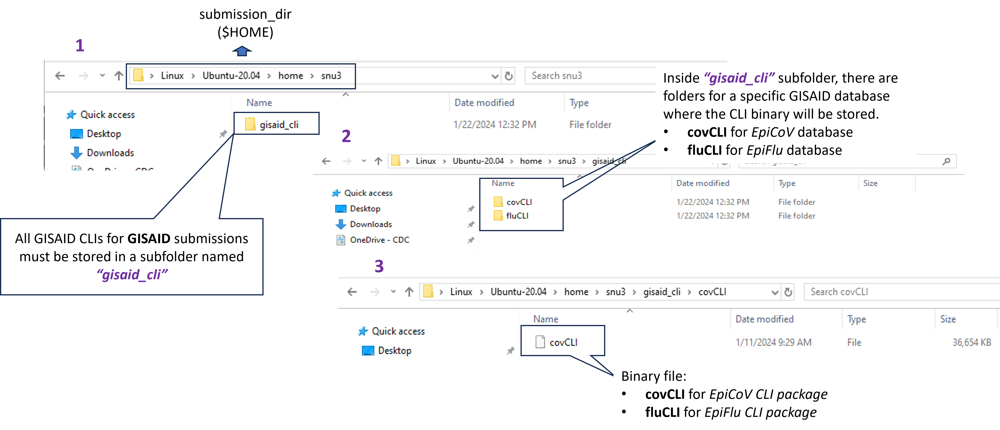

```{r, include=FALSE, echo=FALSE, message=FALSE, warning=FALSE}
# R libraries
library(yaml)  # for yaml file

# Read in the DESCRIPTION file
description <- yaml::read_yaml("../DESCRIPTION")

# Define variables
program <- description$Package

# Define github repo
github_repo <- description$URL

# Define github pages URL
github_pages_url <- description$GITHUB_PAGES
```

- **NCBI Submissions**

``r program`` utilizes an UI-Less Data Submission Protocol to bulk upload submission files (e.g., *submission.xml*, *submission.zip*, etc.) to NCBI archives. The submission files are uploaded to the NCBI server via FTP on the command line. Before attempting to submit a submission using ``r program``, submitter will need to

1. Have a NCBI account. To sign up, visit [NCBI website](https://account.ncbi.nlm.nih.gov/).

2. Required for CDC users and highly recommended for others is creating a center account for your institution/lab [NCBI Center Account Instructions](https://submit.ncbi.nlm.nih.gov/sarscov2/sra/#step6). Center accounts allow you to perform submissions UI-less submissions as your institution/lab.
    
3. Required for CDC users and also recommended is creating a submission group in [NCBI Submission Portal](https://submit.ncbi.nlm.nih.gov). A group should include all individuals who need access to UI-less submissions through the web interface with your center account. Each member of the group must also have an individual NCBI account. [NCBI website](https://account.ncbi.nlm.nih.gov/).

4. Refer to this page for information regarding requirements for GenBank submissions via FTP only. This page applies only for COVID and Influenza [NCBI GenBank FTP Submissions](https://submit.ncbi.nlm.nih.gov/sarscov2/genbank/#step5) For further questions contact <a href="mailto:gb-admin@ncbi.nlm.nih.gov">gb-admin@ncbi.nlm.nih.gov</a> to discuss requirements for submissions.

5. Coordinate a NCBI namespace name (**spuid_namespace**) that will be used with Submitter Provided Unique Identifiers (**spuid**) in the submission. The liaison of **spuid_namespace** and **spuid** is used to report back assigned accessions as well as for cross-linking objects within submission. The values of **spuid_namespace** are up to the submitter to decide but they must be unique and well-coordinated prior to make a submission. For more information about these two fields, see [BioSample]() / [SRA]() / [GENBANK]() metadata requirements.

- **GISAID Submissions**

``r program`` makes use of GISAID's Command Line Interface tools to bulk uploading meta- and sequence-data to GISAID databases. Presently, the pipeline only allows upload to EpiFlu (**Influenza A Virus**) and EpiCoV (**SARS-COV-2**) databases. Before uploading, submitter needs to 

1. Have a GISAID account. To sign up, visit [GISAID Platform](https://gisaid.org/). 

2. Request a client-ID for EpiFlu or EpiCoV database in order to use its CLI tool. The CLI utilizes the client-ID along with the username and password to authenticate the database prior to make a submission. To obtain a client-ID, please email <a href="mailto:clisupport@gisaid.org">clisupport@gisaid.org</a> to request. _**Important note**: If submitter would like to upload a "test" submission first to familiarize themselves with the submission process prior to make a real submission, one should additionally request a test client-id to perform such submissions._

3. Download the <a href="`r github_pages_url`/articles/images/fluCLI_download.png" target="_blank">EpiFlu</a> or <a href="`r github_pages_url`/articles/images/covCLI_download.png" target="_blank">EpiCoV</a> CLI from the **GISAID platform** and stored them in the destination of choice prior to perform a batch upload.

Here is a quick look of where to store the downloaded **GISAID CLI** package.



## Requirement Files

Before submitter can perform a submission using ``r program``, make sure the requirement files (such as *config.yaml*, *metadata.csv*, *sequence.fasta*, *raw reads*, etc.) are already prepared and stored in a submission directory of choice.

(a) To prep for FLU submissions, select one of the databases below to get started:

> <a href="`r github_pages_url`/articles/biosample_submission.html" target="_blank">BioSample</a> <br>
> <a href="`r github_pages_url`/articles/sra_submission.html" target="_blank">SRA</a> <br>
> <a href="`r github_pages_url`/articles/genbank_submission.html" target="_blank">Genbank</a> <br>
> <a href="`r github_pages_url`/articles/gisaid_flu_submission.html" target="_blank">GISAID</a> <br>

(b) To prep for COV submissions, select one of the databases below to get started:

> <a href="`r github_pages_url`/articles/biosample_submission.html" target="_blank">BioSample</a> <br>
> <a href="`r github_pages_url`/articles/sra_submission.html" target="_blank">SRA</a> <br>
> <a href="`r github_pages_url`/articles/genbank_submission.html" target="_blank">Genbank</a> <br>
> <a href="`r github_pages_url`/articles/gisaid_cov_submission.html" target="_blank">GISAID</a> <br>

<br><br><br>

Any questions or issues? Please report them on our
<a href="`r github_repo`/issues" target="_blank">Github
issue tracker</a>.

<br>


